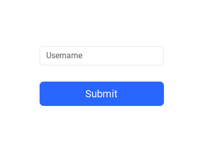

# perl-Authen-TOTP-WebApp

Proof of concept for creating an extensible TOTP 2FA web app. This
project creates a Bootstrap web application running in Docker
container that allows you to create
a secret key for use with two factor authentication.

* Enter your username, click "Submit" and a QR code and secret will
 appear.
* The application will store your secret locally on the web server and
allow you test your access code
* Enter the secret or scan the QR code to your 2FA authentication app
(e.g. Google Authenticator)



---


---


---

# Other Features

The Perl module behind the scenes `Authen::TOTP::WebApp` is designed
to be sub-classed so you can easily modify the behaviors to provide
your own forms and your own key storage mechanism.  See the
documentation for [`Authen::TOTP::WebApp`](/Authen/TOTP/WebApp.pod) for more details.

# Dependencies

* `docker`
* `docker-compose`
* `make`
* Perl modules

## Perl module dependencies

__...and possibly more__

* `Archive::Tar`
* `IO::Zlib`
* `Authen::OATH`
* `Cache::FileCache` 
* `CGI::Minimal`
* `Class::Accessor::Fast`
* `Convert::Base32`
* `Imager::QRCode`
* `IO::Scalar`
* `JSON`
* `Readonly`
* `Template`
* `URI::Encode`

> Building `Imager` will require `libpng-devel` on Redhat base systems.

The web application consists of two Perl modules, a Perl CGI, a
configuration file and a Javascript file. You should be able to get
this working by creating a Docker container and running
`docker-compose`.

# How It Works

The CGI will deliver a form to your browser where you can enter a
username. A secret key and a QR code will be returned.

The form is actually created by Perl CGI, however you can deliver your
own form and use the Perl CGI's API methods instead.

## Endpoints

Endpoints all point to `qrcode.cgi`.

```
RewriteRule ^/2fa              /cgi-bin/qrcode.cgi  [PT]
RewriteRule ^/qrcode/([^/]+)$  /cgi-bin/qrcode.cgi?username=$1 [PT]
RewriteRule ^/login            /cgi-bin/qrcode.cgi?login=1 [PT]
RewriteRule ^/verify$          /cgi-bin/qrcode.cgi?username=$1&access_code=$2 [PT]
```

AllowEncodedSlashes On

| Endpoint | Description | Method | Parameters | 
| -------- | ----------- | ------ | ---------- | 
| /qrcode/{username} | returns a JSON payload with a base64 encoded QR code | GET | username |
| /2fa  | returns an HTML form for creating a secret and QR code | GET |
| /verify | returns a JSON payload with "matched" - a boolean that indicates if the access code is valid | POST | username, access_code |
| /login | returns an HTML for entering username and access code | GET | |

# Building the Docker Container

```
git clone https://github.com/rlauer6/perl-Authen-TOTP-WebApp
cd perl-Authen-TOTP-WebApp
cd docker
make
```

After running `make` you should have a Docker image
(`authen-totp-webapp`). Now bring up the application.

```
docker-compose up
```

In your browser visit:

http://localhost:8080/2fa

This will bring up the app where you can enter a username.  Click the
"Submit" button to get the QR code and secret. Scan the QR code or
enter the key in your authentication app.

Click "Try It!" to test your access code.

You can also visit http://localhost:8080/login to test your
access code.

# License

Copyright (c) 2023 Robert Lauer. All rights reserved. This
program is free software; you can redistribute it and/or modify it
under the same terms as Perl itself.
